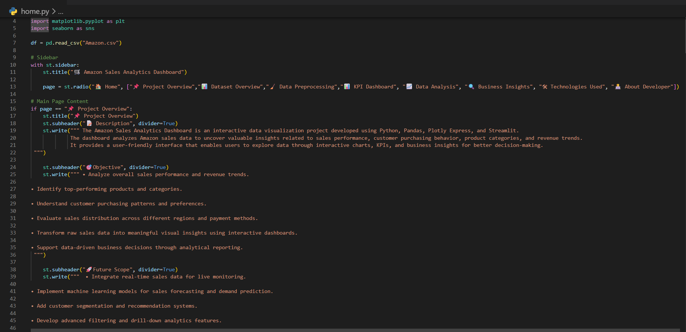
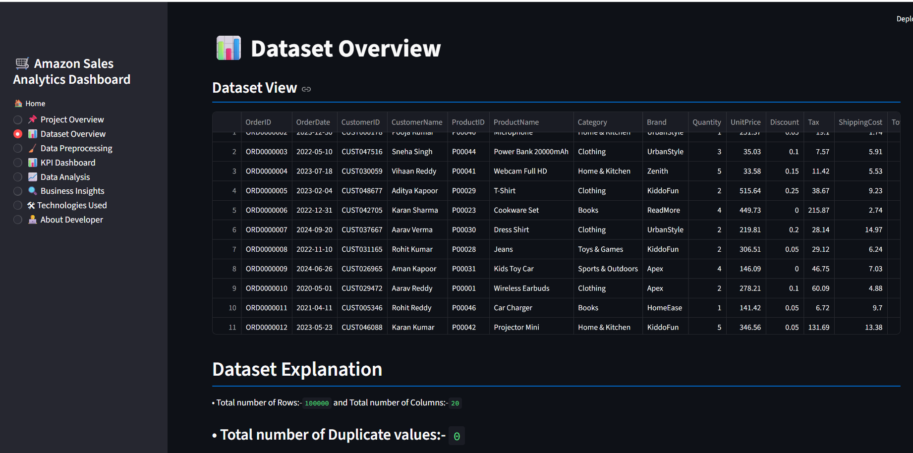
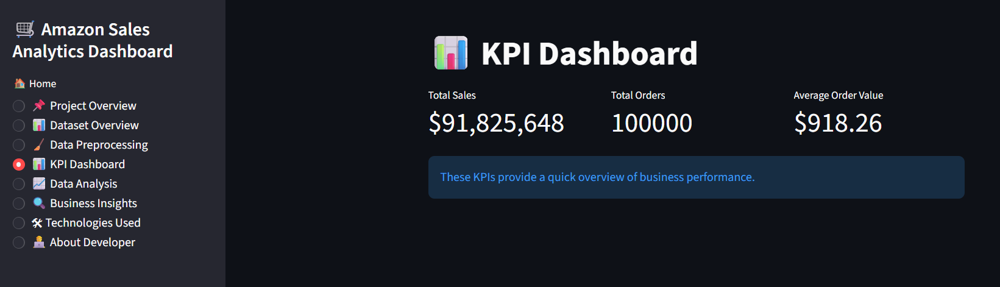
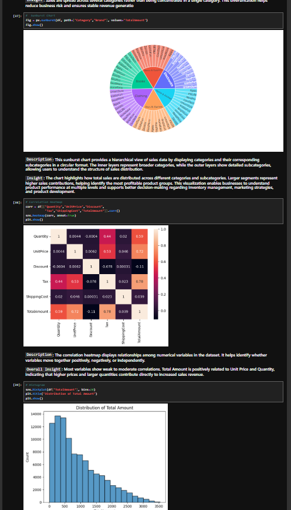
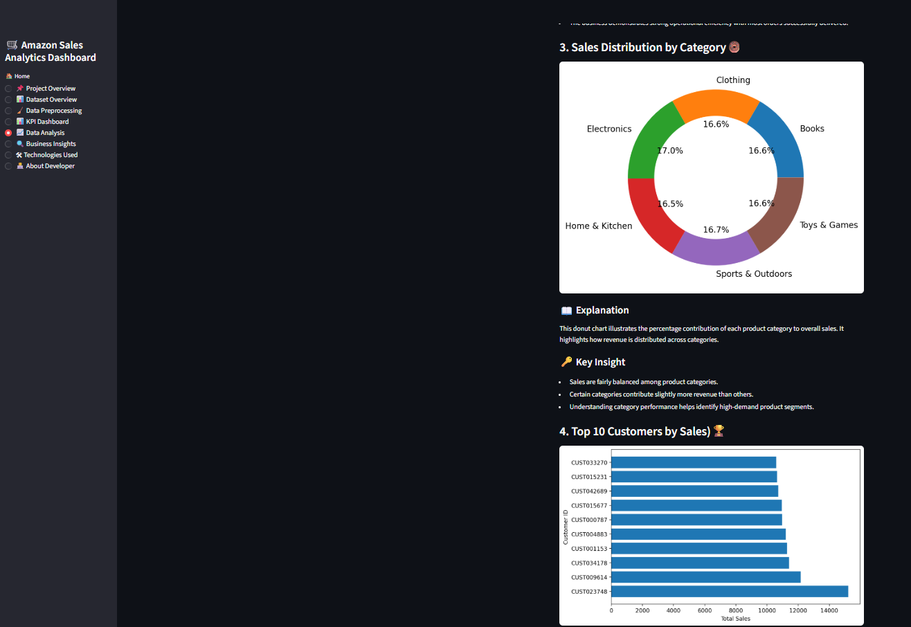

# 📊 Amazon Sales Analysis Dashboard

## 📌 Project Overview

This project analyzes Amazon sales data using Python, Pandas, NumPy, Matplotlib, Seaborn, Plotly, and Streamlit. The dashboard provides insights into sales performance, customer behavior, product categories, and business trends through interactive visualizations.

---

## 🛠️ Technologies Used

* Python
* Pandas
* NumPy
* Matplotlib
* Seaborn
* Plotly
* Streamlit

---

## 📸 Project Screenshots

### 🏠 Home Page



### 📋 Dataset Overview



### 📈 KPI Dashboard



### 📊 Dashboard



### 📉 Visualizations



---

## 🚀 How to Run the Project

```bash
pip install -r requirements.txt
streamlit run home.py
```

---

## 🎯 Key Features

* Dataset Exploration
* Data Cleaning and Preprocessing
* KPI Dashboard
* Interactive Visualizations
* Business Insights
* Streamlit Web Application
